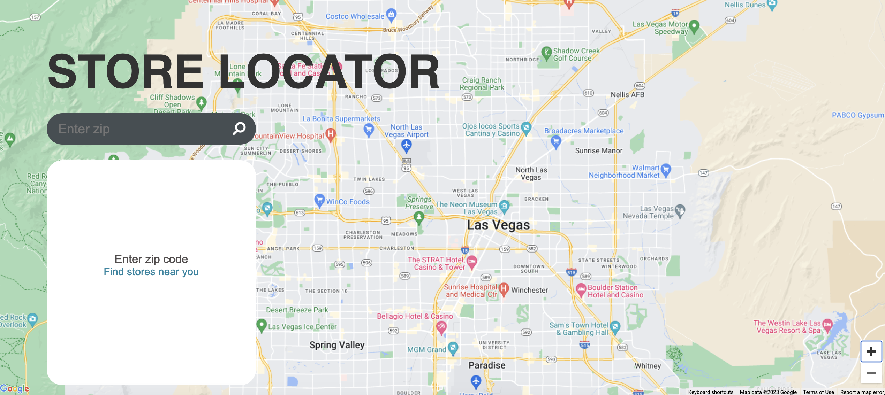
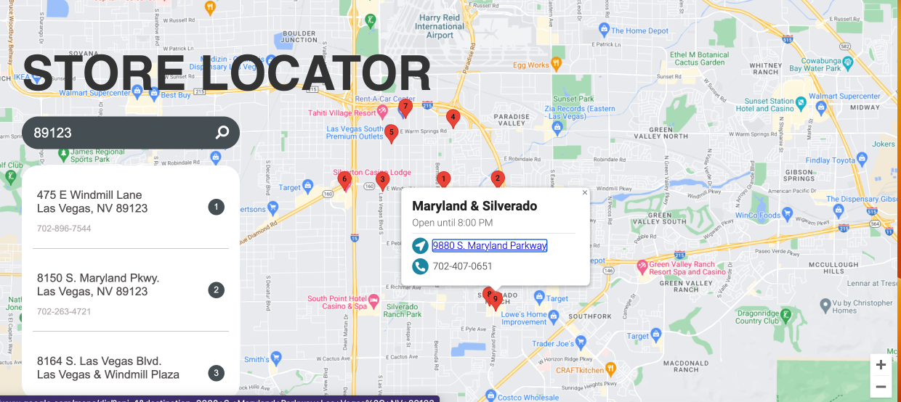

# Building Google Maps Store Locator with JavaScript, Node JS, and MongoDB

## Project Description
This Google Maps Store Locator is to allow users to find store near them.Having a user-friendly store locator is essential for businesses looking to connect with their customers. 
## Project Planning & Requirements

- Google Maps Store Locator Mockup 
(https://www.figma.com/file/tXCsbfJ2owMqtTeEKQUPfy/Google-Maps-Store-Locator?type=design&node-id=0%3A1&mode=design&t=XYWH0YKWJ7BX9Y3g-1)
- Google Maps Store Locator Software Requirements (https://docs.google.com/document/d/1EkdrHnqy-HN7qX3G0aG-NNSnC6ftbI3KN8Zyr5wfQX8/edit?usp=sharing)

- Wireframe of Google Maps (https://app.diagrams.net/#G1WUt_7NUuX4Sas0sRlvUIO8Nl2w3Hb2CO)

- Import Google Maps into the project (https://developers.google.com/maps/documentation/javascript/load-maps-js-api#javascript)
- Add marker on the Map 
  (https://developers.google.com/maps/documentation/javascript/examples/marker-simple)

## Project Screenshot

## Initialization

Clone the repository into a folder

    git clone <Link>

Install NodeJS from this [LINK](https://nodejs.org/en/)

Navigate to `Google-maps-app-api` folder

Open Terminal

    npm install
    npm install -g nodemon

Create `app.js` file    

- Get your own stores data [LINK](https://www.starbucks.com/store-locator)

- Set up NodeJS Server [LINK](https://expressjs.com/)
- Create a MongoDB Database in MongoDB Atlas [LINK](https://www.mongodb.com/atlas/database)
- Setup Mongoose to connect to MongoDB [LINK](https://mongoosejs.com/docs/connections.html)

